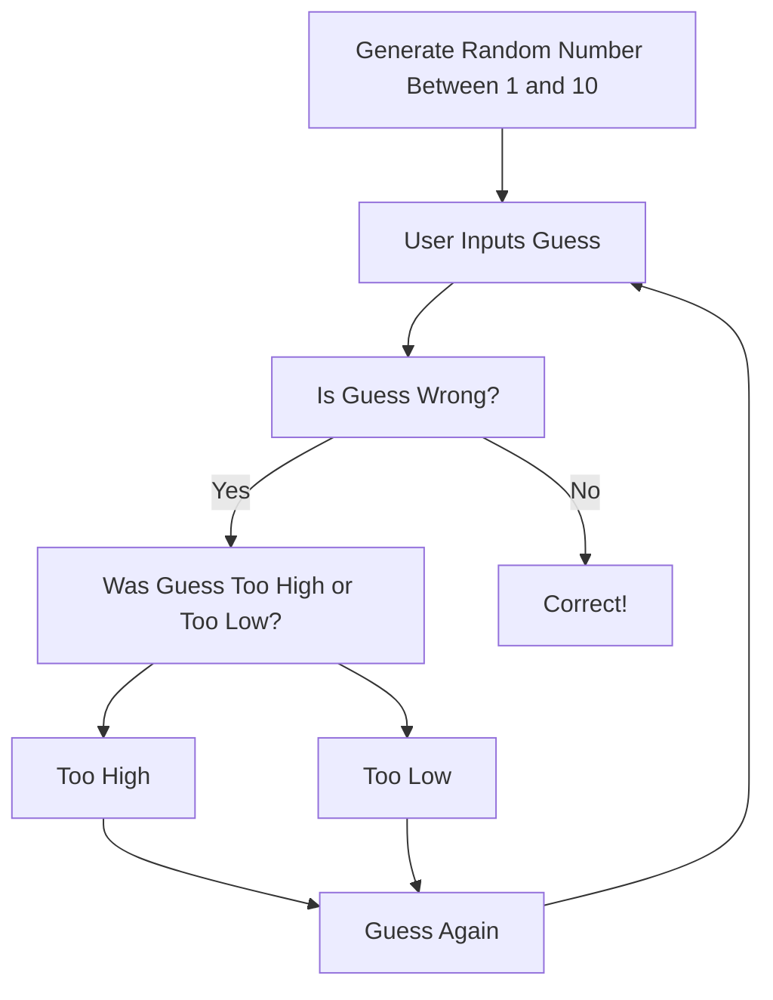

This is a number guessing game.  
A random number between 1 and 10 will be generated.  
User inputs what they think the number is.  
If you are wrong, a message will display telling you if you have guessed too high or too low and you will guess again.  
If you are right, a message will display telling you that you have guessed correctly.